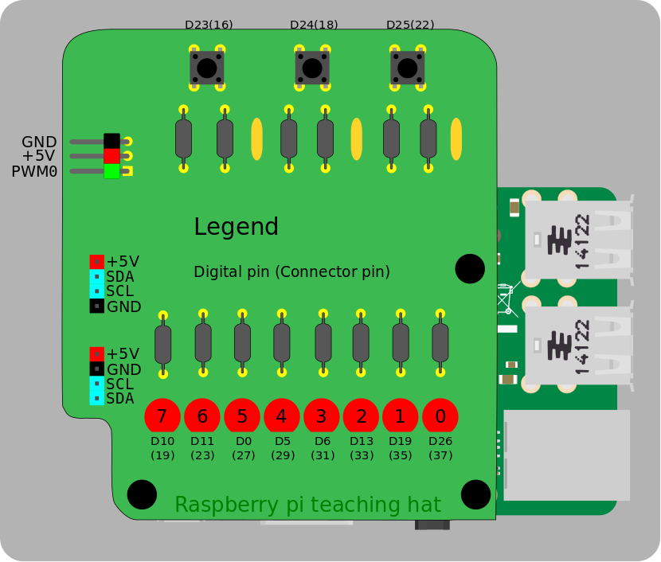

# raspberry-pi-teaching-hat


## Pinout




## Programa de ejemplo
Un programa de ejemplo se encuentra en la carpeta lib/

Ejecutar:

```bash
gcc ejemplo.c && sudo ./a.out
```
Nota: sudo es necesario para acceder al pinout.

---
Para más información ir a la [Wiki](https://github.com/MartinNievas/raspberry-pi-teaching-hat/wiki)
---
